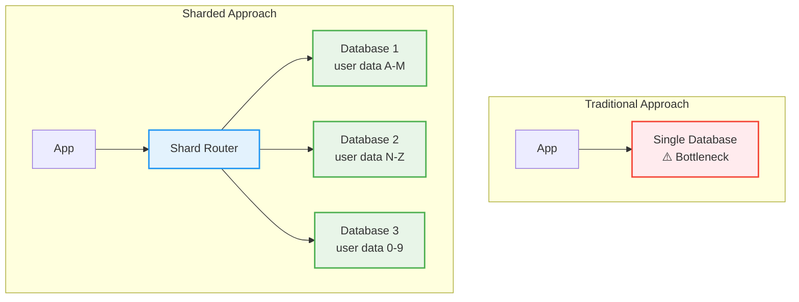

# Database Sharding: Scaling Writes in .NET

This project demonstrates how to scale write-heavy applications using database sharding with .NET and MySQL. Instead of trying to make one database faster, we distribute writes across multiple databases.

## 🎯 What is Scaling Writes?

**Scaling writes** means handling more write operations (create, update, delete) as your application grows. When your application becomes popular, you'll have more users creating more data, and a single database can't keep up.

### The Challenge

Imagine a social media app:
- 100 users → Your database handles it fine
- 10,000 users → Still manageable  
- 1,000,000 users → Database becomes a bottleneck
- 10,000,000 users → Database crashes under the load

**The Problem**: Single databases have physical limits:
- CPU and memory constraints
- Connection limits
- Disk I/O bottlenecks
- Lock contention from concurrent writes

## 🏗️ The Solution: Database Sharding

**Database sharding** solves this by splitting your data across multiple databases (called "shards"). Instead of one database handling all writes, you have multiple databases each handling a portion of your data.

### How It Works


```

### Benefits of Sharding

- **Horizontal Scaling**: Add more databases as you grow
- **Better Performance**: Write operations distribute across servers
- **Fault Isolation**: One shard failing doesn't crash everything
- **Geographic Distribution**: Put shards closer to users

## 🚀 How This Project Works

This implementation uses **consistent hashing** to automatically determine which database should store each piece of data.

### Key Components

1. **Shard Resolution**: When you create a user, the system automatically decides which database to use
2. **Data Distribution**: Similar data goes to similar locations (users A-M together, N-Z together)
3. **Cross-Shard Queries**: When you need data from all shards, it queries them in parallel
4. **Transparent Operation**: Your application code doesn't need to know which database contains what

### Example Flow

```
1. Create User "John Doe"
   ↓
2. System hashes "John Doe" → "shard_2"
   ↓  
3. User saved to database shard_2
   ↓
4. Return user ID to application
```

## 🎮 Quick Start

### Prerequisites
- .NET 10.0 SDK
- Docker and Docker Compose

### Run the Demo

```bash
# Start the database shards
docker-compose up -d

# Run the application
cd ScalingWrites.Core
dotnet run
```

### Test the API

```bash
# Create a user (automatically routed to a shard)
curl -X POST "https://localhost:5001/api/users" \
     -H "Content-Type: application/json" \
     -d '{"name": "John Doe"}'

# The response includes a user ID
# Check which shard stored this user by looking at the database logs
```

## 📊 Understanding the Data Flow

### Shard Distribution

The system creates 6 MySQL database shards:
- **Shard 0**: Port 3306
- **Shard 1**: Port 3307  
- **Shard 2**: Port 3308
- **Shard 3**: Port 3309
- **Shard 4**: Port 3310
- **Shard 5**: Port 3311

When you create data:
1. The system looks at the data's ID (GUID or other key)
2. Uses consistent hashing to determine the shard
3. Saves the data to the correct shard
4. Returns the result to your application

### Simple Architecture

```mermaid
flowchart TD
    A[Your Application<br/>UserController.CreateUser()] --> B[IShardDbContextFactory]
    B --> C[Hash<br/>user-guid → Shard_2]
    C --> D[Database Shard 2]

    %% Styling
    classDef app fill:#e3f2fd,stroke:#1976d2,stroke-width:2px
    classDef factory fill:#f3e5f5,stroke:#7b1fa2,stroke-width:2px
    classDef hash fill:#fff3e0,stroke:#f57c00,stroke-width:2px
    classDef db fill:#e8f5e8,stroke:#388e3c,stroke-width:2px

    class A app
    class B factory
    class C hash
    class D db
```

## 🔑 Key Concepts

### 1. Consistent Hashing

**What it does**: Distributes data evenly across shards while minimizing reorganization when shards are added/removed.

**Why it matters**: 
- New users are distributed fairly
- Adding new shards doesn't require moving most data
- Performance stays consistent as you scale

### 2. Shard Keys

**What they are**: The piece of data used to decide which shard stores your information.

**In this project**:
- **Users**: Sharded by `User.Id` (GUID)
- **Publications**: Sharded by `Publication.Id` (GUID) or associated `User.Id`

### 3. Cross-Shard Operations

**When needed**: When you need data from multiple shards (like searching all users).

**How it works**: 
- Query all shards in parallel
- Combine results into a single response
- Example: "Find all publications" queries all 6 shards

### 4. Strategy Pattern

**What it does**: Different types of data use different sharding strategies.

**In this project**:
- **GUID-based data**: Uses hash-based distribution
- **Numeric data**: Could use range-based distribution  
- **Date-based data**: Could group by date ranges

## 📈 When to Use Sharding

### Good Use Cases
- High write volume (thousands of writes per second)
- Large datasets (millions of records)
- Growing applications with predictable growth
- Applications where data can be partitioned naturally

### Not Suitable For
- Small applications (< 100K records)
- Applications requiring complex joins across all data
- When you can optimize a single database first
- Teams without DevOps/database expertise

## 🛠️ Production Considerations

### What You'll Need
- **Monitoring**: Track shard performance and data distribution
- **Backup Strategy**: Backup each shard separately
- **Load Balancing**: Route reads to replicas if needed
- **Health Checks**: Detect when shards go down

### Operational Tasks
- Monitor shard utilization (don't let one get overloaded)
- Plan shard additions before you need them
- Test recovery procedures
- Consider read replicas for query performance

## 🎓 Learning Path

### Beginner
1. Understand the concept of sharding
2. See how this project distributes data
3. Run the demo and observe shard usage

### Intermediate  
1. Add a new entity type with sharding
2. Implement custom sharding strategies
3. Add monitoring and health checks

### Advanced
1. Implement automatic shard rebalancing
2. Add cross-shard transactions
3. Set up geographic shard distribution

---

**This project demonstrates production-ready sharding patterns**. The code is structured for real-world use while remaining educational. Use it as a starting point for your own scalable applications!