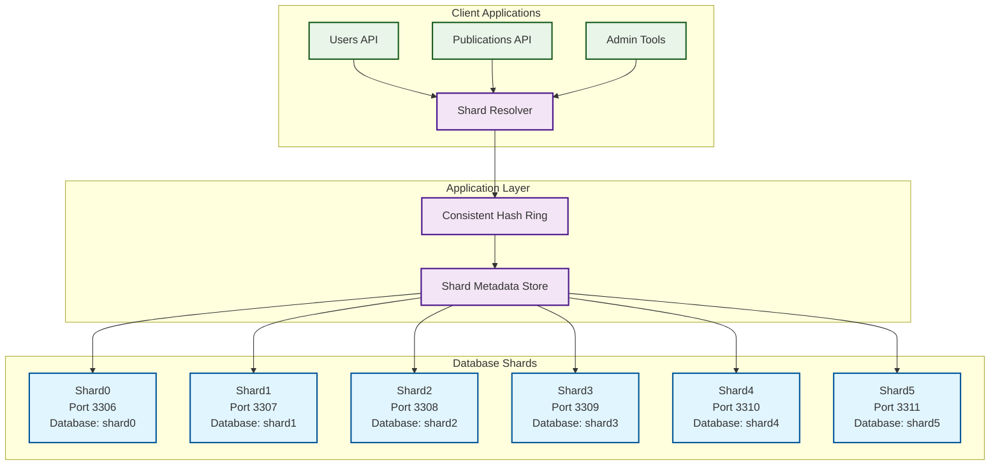
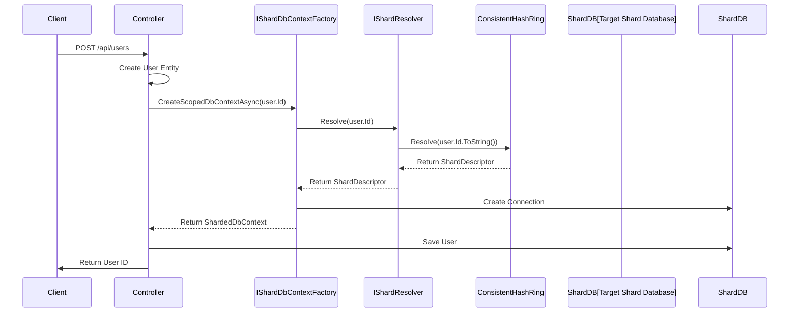
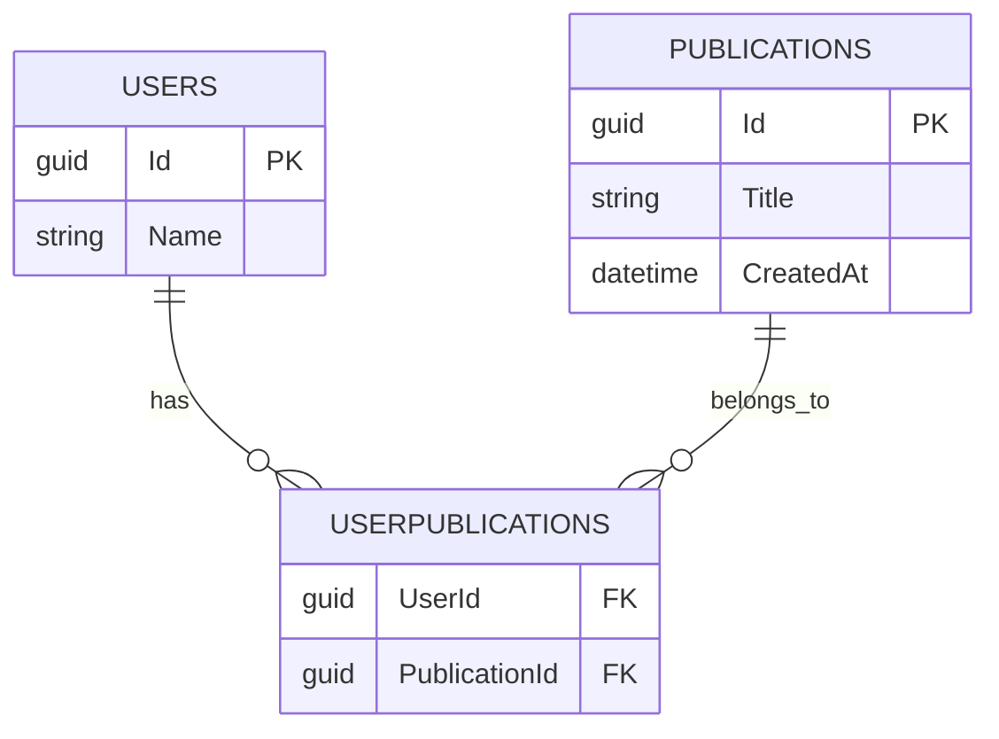
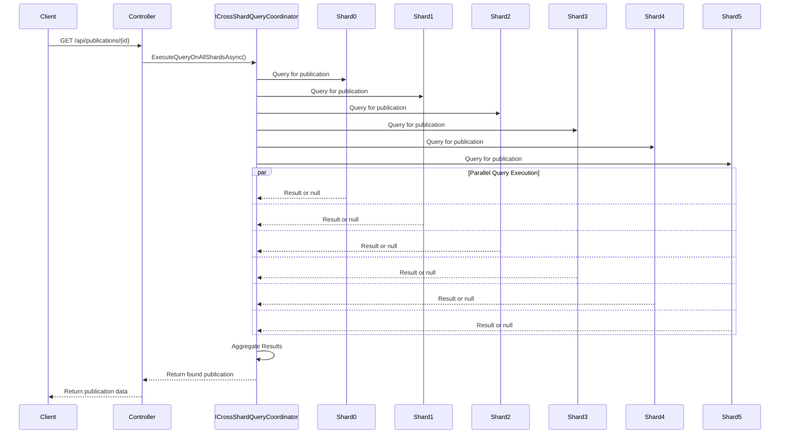
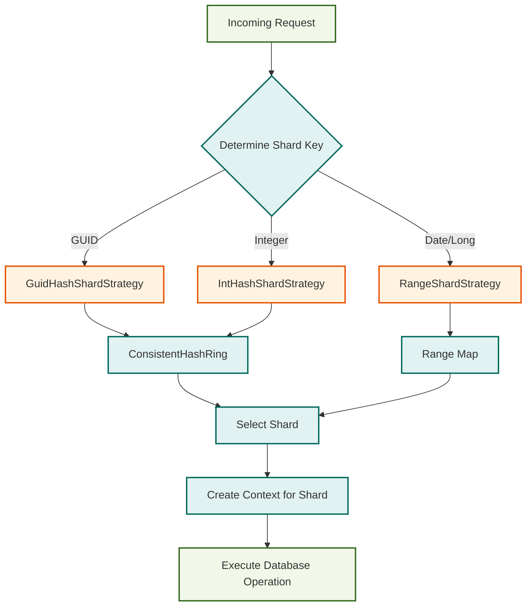
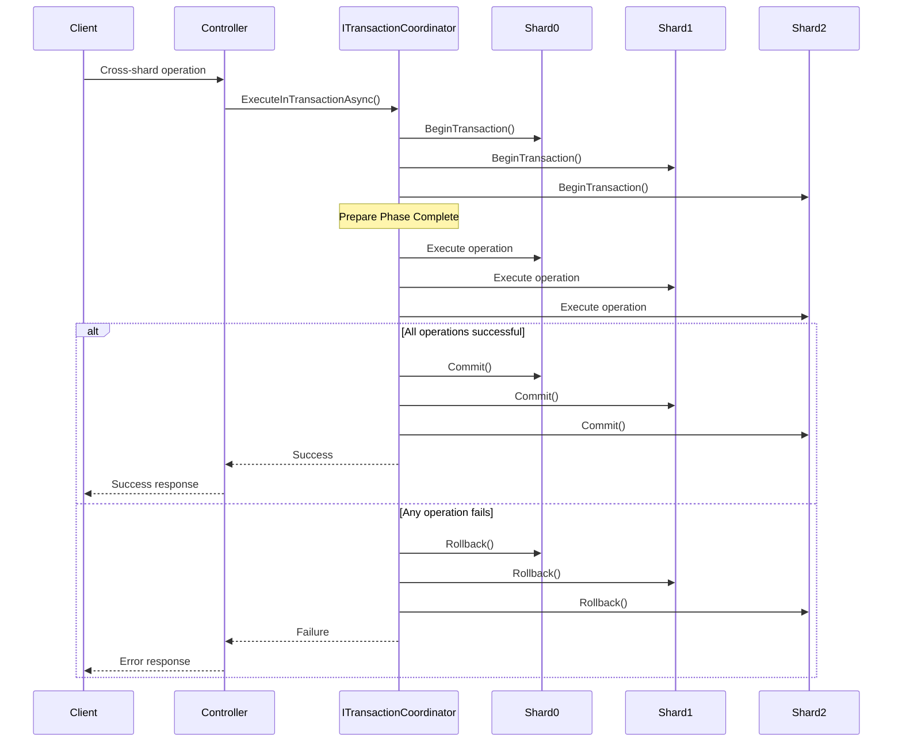

# Database Sharding Tutorial: Scaling Writes with .NET and MySQL

This tutorial guides you through implementing database sharding to scale write operations in a .NET application. You'll learn how to distribute data across multiple MySQL database shards using consistent hashing, enabling horizontal scaling for write-heavy workloads.

## 🎯 What You'll Learn

By the end of this tutorial, you'll understand:
- **Database Sharding Concepts**: How to distribute data across multiple databases
- **Consistent Hashing**: A technique for even data distribution and minimal rebalancing
- **EF Core Integration**: Implementing sharding with Entity Framework Core
- **Real-World Implementation**: Building a REST API with sharded data
- **Cross-Shard Queries**: Executing queries across multiple shards with result aggregation
- **Transaction Coordination**: Managing transactions across multiple database shards

**Key Benefits of Sharding:**
- **Horizontal Write Scaling**: Distribute write operations across multiple database instances
- **Improved Performance**: Reduce contention and increase throughput
- **Fault Isolation**: Database issues in one shard don't affect others
- **Scalability**: Add more shards as your data grows

## 📋 Prerequisites

Before starting, ensure you have:
- .NET 10.0 SDK (or later)
- Docker and Docker Compose
- Basic knowledge of C#, ASP.NET Core, and Entity Framework Core
- Understanding of relational databases and SQL

## 🏗️ Step 1: Understanding the Architecture

This project implements sharding using several key components organized in a clean, maintainable structure. Let's examine each one:

### 1.1 Project Structure

```
ScalingWrites.Core/
├── Controllers/
│   ├── UsersController.cs              # User CRUD operations with sharding
│   └── PublicationsController.cs       # Publication operations with cross-shard queries
├── Data/
│   ├── Configurations/
│   │   ├── ShardResolvers/             # Pluggable shard resolution strategies
│   │   │   ├── IShardResolver.cs       # Main resolver interface
│   │   │   ├── IShardResolutionStrategy.cs # Strategy interface
│   │   │   ├── ShardResolver.cs        # Main resolver implementation
│   │   │   ├── IntHashShardStrategy.cs # Integer key hashing
│   │   │   ├── GuidHashShardStrategy.cs # GUID key hashing
│   │   │   └── RangeShardStrategy.cs   # Range-based partitioning
│   │   ├── ConsistentHashRing.cs       # Consistent hashing implementation
│   │   ├── ShardDescriptor.cs          # Shard metadata model
│   │   ├── IShardMetadataStore.cs      # Configuration management
│   │   ├── ShardMetadataStore.cs       # In-memory metadata store
│   │   ├── ICrossShardQueryCoordinator.cs # Cross-shard queries
│   │   ├── CrossShardQueryCoordinator.cs  # Query coordination
│   │   ├── ITransactionCoordinator.cs  # Transaction management
│   │   └── TransactionCoordinator.cs   # Cross-shard transactions
│   ├── IShardDbContextFactory.cs       # Unified factory interface
│   ├── ShardDbContextFactory.cs        # Context factory implementation
│   ├── ShardedDbContext.cs             # EF Core context
│   └── ShardedDesignTimeFactory.cs     # Migration support
├── Helpers/
│   └── ShardConfigurationHelper.cs     # Configuration loading
├── Models/
│   ├── User.cs                         # User entity
│   └── Publication.cs                  # Publication entity
└── Migrations/                         # EF Core migrations
```

### 1.2 Sharding Infrastructure

The sharding system consists of interfaces and implementations that determine which database shard handles each operation.

#### Core Interfaces

**[`IShardResolver`](ScalingWrites.Core/Data/Configurations/ShardResolvers/IShardResolver.cs)**: Defines the contract for shard resolution.
```csharp
namespace ScalingWrites.Core.Data.Configurations;

public interface IShardResolver
{
    ShardDescriptor Resolve(object shardKey);
}
```

**[`IShardResolutionStrategy`](ScalingWrites.Core/Data/Configurations/ShardResolvers/IShardResolutionStrategy.cs)**: Defines strategies for different key types.
```csharp
namespace ScalingWrites.Core.Data.Configurations;

public interface IShardResolutionStrategy
{
    bool CanResolve(object shardKey);
    ShardDescriptor Resolve(object shardKey, IReadOnlyList<ShardDescriptor> shards);
}
```

**[`IShardDbContextFactory`](ScalingWrites.Core/Data/IShardDbContextFactory.cs)**: Unified factory for creating sharded contexts.
```csharp
namespace ScalingWrites.Core.Data;

public interface IShardDbContextFactory
{
    Task<ShardDescriptor> ResolveShardAsync(object shardKey);
    Task<string> GetConnectionStringAsync(ShardDescriptor shard);
    Task<ShardedDbContext> CreateScopedDbContextAsync(object shardKey);
}
```

#### Implementations

**[`ShardResolver`](ScalingWrites.Core/Data/Configurations/ShardResolvers/ShardResolver.cs)**: The main resolver that delegates to appropriate strategies.
```csharp
namespace ScalingWrites.Core.Data.Configurations;

public sealed class ShardResolver(IReadOnlyList<ShardDescriptor> shards, IEnumerable<IShardResolutionStrategy> strategies) : IShardResolver
{
    public ShardDescriptor Resolve(object shardKey)
    {
        var strategy = strategies.FirstOrDefault(s => s.CanResolve(shardKey));
        return strategy is null
            ? throw new InvalidOperationException($"No shard strategy registered for key type {shardKey?.GetType().Name}")
            : strategy.Resolve(shardKey, shards);
    }
}
```

**[`ShardDbContextFactory`](ScalingWrites.Core/Data/ShardDbContextFactory.cs)**: Creates context instances for specific shards using async operations.
```csharp
namespace ScalingWrites.Core.Data;

public sealed class ShardDbContextFactory(IShardResolver resolver) : IShardDbContextFactory, IDbContextFactory<ShardedDbContext>
{
    public async Task<ShardDescriptor> ResolveShardAsync(object shardKey)
    {
        return resolver.Resolve(shardKey);
    }

    public async Task<ShardedDbContext> CreateScopedDbContextAsync(object shardKey)
    {
        var shard = await ResolveShardAsync(shardKey);
        var connectionString = await GetConnectionStringAsync(shard);

        var optionsBuilder = new DbContextOptionsBuilder<ShardedDbContext>();
        optionsBuilder.UseMySQL(connectionString);

        return new ShardedDbContext(optionsBuilder.Options);
    }
}
```

#### Shard Resolution Strategies

**[`IntHashShardStrategy`](ScalingWrites.Core/Data/Configurations/ShardResolvers/IntHashShardStrategy.cs)**, **[`GuidHashShardStrategy`](ScalingWrites.Core/Data/Configurations/ShardResolvers/GuidHashShardStrategy.cs)**: Strategies for integer and GUID keys using consistent hashing.

**[`RangeShardStrategy`](ScalingWrites.Core/Data/Configurations/ShardResolvers/RangeShardStrategy.cs)**: Range-based partitioning for numeric and date keys.
```csharp
public sealed class RangeShardStrategy(IReadOnlyList<ShardDescriptor> shards) : IShardResolutionStrategy
{
    private readonly SortedDictionary<long, ShardDescriptor> _rangeMap = BuildRangeMap(shards);

    public bool CanResolve(object key) => key is int or long or DateTime;

    public ShardDescriptor Resolve(object key, IReadOnlyList<ShardDescriptor> _)
    {
        // Range-based resolution logic
        // Divides long range evenly across shards
        // ...
    }
}
```

**[`ConsistentHashRing`](ScalingWrites.Core/Data/Configurations/ConsistentHashRing.cs)**: Implements consistent hashing with virtual nodes.
```csharp
using System.Security.Cryptography;
using System.Text;

namespace ScalingWrites.Core.Data.Configurations;

public sealed class ConsistentHashRing
{
    private readonly SortedDictionary<int, ShardDescriptor> _ring = [];

    public ConsistentHashRing(IEnumerable<ShardDescriptor> shards, int replicas = 100)
    {
        foreach (var shard in shards)
        {
            for (int i = 0; i < replicas; i++)
            {
                var key = Hash($"{shard.Name}:{i}");
                _ring[key] = shard;
            }
        }
    }

    public ShardDescriptor Resolve(string key)
    {
        var node = _ring.Keys.FirstOrDefault(k => k >= Hash(key));
        if (node == 0) node = _ring.Keys.First();
        return _ring[node];
    }

    private static int Hash(string value)
    {
        var bytes = SHA256.HashData(Encoding.UTF8.GetBytes(value));
        return BitConverter.ToInt32(bytes, 0);
    }
}
```

### 1.3 Database Context Layer

**[`ShardedDbContext`](ScalingWrites.Core/Data/ShardedDbContext.cs)**: EF Core context with your entities.
```csharp
using Microsoft.EntityFrameworkCore;
using ScalingWrites.Core.Models;

namespace ScalingWrites.Core.Data;

public class ShardedDbContext : DbContext
{
    public ShardedDbContext(DbContextOptions<ShardedDbContext> options) : base(options)
    {

    }

    public DbSet<User> Users => Set<User>();
    public DbSet<Publication> Publications => Set<Publication>();

    protected override void OnModelCreating(ModelBuilder modelBuilder)
    {
        modelBuilder.Entity<User>(e =>
        {
            e.HasKey(u => u.Id);
            e.Property(u => u.Name).IsRequired();

            e.HasMany(u => u.Publications)
             .WithMany()
             .UsingEntity("UserPublications");
        });

        modelBuilder.Entity<Publication>(e =>
        {
            e.HasKey(p => p.Id);
            e.Property(p => p.Title).IsRequired();
            e.Property(p => p.CreatedAt).IsRequired();
        });
    }
}
```

### 1.4 Models

**[`User`](ScalingWrites.Core/Models/User.cs)**: Entity with auto-generated GUID ID.
```csharp
namespace ScalingWrites.Core.Models;

public class User
{
    public Guid Id { get; } = Guid.NewGuid();
    public required string Name { get; set; }
    public List<Publication> Publications { get; } = [];
}
```

**[`Publication`](ScalingWrites.Core/Models/Publication.cs)**: Entity with GUID ID.
```csharp
namespace ScalingWrites.Core.Models;

public class Publication
{
    public Guid Id { get; }
    public required DateTime CreatedAt { get; set; } = DateTime.Now;
    public required string Title { get; set; }
}
```

### 1.5 Configuration

**[`ShardDescriptor`](ScalingWrites.Core/Data/Configurations/ShardDescriptor.cs)**: Represents a shard.
```csharp
namespace ScalingWrites.Core.Data.Configurations;

public record ShardDescriptor(int Id, string Name, string ConnectionString);
```

**[`ShardConfigurationHelper`](ScalingWrites.Core/Helpers/ShardConfigurationHelper.cs)**: Loads shards from configuration with caching support.
```csharp
using Microsoft.Extensions.Caching.Memory;
using ScalingWrites.Core.Data.Configurations;

namespace ScalingWrites.Core.Helpers;

public static class ShardConfigurationHelper
{
    private const string CacheKey = "shard_metadata";
    private static readonly TimeSpan CacheExpiration = TimeSpan.FromMinutes(30);

    public static async Task<IReadOnlyList<ShardDescriptor>> LoadShardsAsync(IConfiguration config, IMemoryCache cache)
    {
        // Try to get from cache first
        if (cache.TryGetValue(CacheKey, out List<ShardDescriptor>? cachedShards) && 
            cachedShards != null && 
            cachedShards.Count > 0)
        {
            return cachedShards.AsReadOnly();
        }

        // Load from configuration
        var loadedShards = LoadShards(config);

        // Cache the shards
        var shardList = loadedShards.ToList();
        cache.Set(CacheKey, shardList, new MemoryCacheEntryOptions
        {
            AbsoluteExpirationRelativeToNow = CacheExpiration
        });

        return shardList.AsReadOnly();
    }
}
```

### 1.6 Cross-Shard Query Support

**[`ICrossShardQueryCoordinator`](ScalingWrites.Core/Data/Configurations/ICrossShardQueryCoordinator.cs)**: Handles fan-out queries and result aggregation.
```csharp
using System.Linq.Expressions;

namespace ScalingWrites.Core.Data.Configurations;

public interface ICrossShardQueryCoordinator
{
    Task<IEnumerable<T>> ExecuteQueryOnAllShardsAsync<T>(
        Expression<Func<ShardedDbContext, IQueryable<T>>> queryExpression) where T : class;

    Task<IEnumerable<T>> ExecuteQueryOnSpecificShardsAsync<T>(
        IEnumerable<ShardDescriptor> shards,
        Expression<Func<ShardedDbContext, IQueryable<T>>> queryExpression) where T : class;

    Task<T> AggregateResultsAsync<T>(
        IEnumerable<T> results,
        Func<IEnumerable<T>, T> aggregator);
}
```

**[`CrossShardQueryCoordinator`](ScalingWrites.Core/Data/Configurations/CrossShardQueryCoordinator.cs)**: Parallel query execution across shards.
```csharp
public sealed class CrossShardQueryCoordinator(IShardMetadataStore metadataStore, IShardDbContextFactory contextFactory) : ICrossShardQueryCoordinator
{
    public async Task<IEnumerable<T>> ExecuteQueryOnAllShardsAsync<T>(
        Expression<Func<ShardedDbContext, IQueryable<T>>> queryExpression) where T : class
    {
        var shards = await metadataStore.LoadShardsAsync();
        return await ExecuteQueryOnSpecificShardsAsync(shards, queryExpression);
    }

    public async Task<IEnumerable<T>> ExecuteQueryOnSpecificShardsAsync<T>(
        IEnumerable<ShardDescriptor> shards,
        Expression<Func<ShardedDbContext, IQueryable<T>>> queryExpression) where T : class
    {
        var tasks = shards.Select(async shard =>
        {
            await using var db = await contextFactory.CreateScopedDbContextAsync(shard.Id);
            var query = queryExpression.Compile()(db);
            return await query.ToListAsync();
        });

        var results = await Task.WhenAll(tasks);
        return results.SelectMany(r => r);
    }
}
```

### 1.7 Transaction Coordination

**[`ITransactionCoordinator`](ScalingWrites.Core/Data/Configurations/ITransactionCoordinator.cs)**: Manages transactions across multiple shards.
```csharp
namespace ScalingWrites.Core.Data.Configurations;

public interface ITransactionCoordinator
{
    Task ExecuteInTransactionAsync(Func<Task> operation, IEnumerable<ShardDescriptor> shards);
    Task<T> ExecuteInTransactionAsync<T>(Func<Task<T>> operation, IEnumerable<ShardDescriptor> shards);
    Task ExecuteTwoPhaseCommitAsync(Func<Task> prepareOperation, Func<Task> commitOperation, IEnumerable<ShardDescriptor> shards);
}
```

**[`TransactionCoordinator`](ScalingWrites.Core/Data/Configurations/TransactionCoordinator.cs)**: Implements cross-shard transactions with rollback support.
```csharp
public sealed class TransactionCoordinator(IShardDbContextFactory contextFactory) : ITransactionCoordinator
{
    public async Task ExecuteInTransactionAsync(Func<Task> operation, IEnumerable<ShardDescriptor> shards)
    {
        var shardContexts = new List<(ShardDescriptor Shard, ShardedDbContext Context, IDbContextTransaction Transaction)>();

        try
        {
            // Prepare phase: Create transactions on all shards
            foreach (var shard in shards)
            {
                var context = await contextFactory.CreateScopedDbContextAsync(shard.Id);
                var transaction = await context.Database.BeginTransactionAsync();
                shardContexts.Add((shard, context, transaction));
            }

            // Execute the operation
            await operation();

            // Commit phase: Commit all transactions
            foreach (var (_, _, transaction) in shardContexts)
            {
                await transaction.CommitAsync();
            }
        }
        catch (Exception)
        {
            // Rollback phase: Rollback all transactions
            foreach (var (_, _, transaction) in shardContexts)
            {
                try
                {
                    await transaction.RollbackAsync();
                }
                catch
                {
                    // Log rollback failure but continue with other rollbacks
                }
            }
            throw;
        }
        finally
        {
            // Cleanup: Dispose contexts and transactions
            foreach (var (_, context, transaction) in shardContexts)
            {
                await transaction.DisposeAsync();
                await context.DisposeAsync();
            }
        }
    }
}
```

### 1.8 Database Architecture Visualization

Understanding how your data is distributed across shards is crucial. Here are visual representations of the sharding architecture:

#### Shard Distribution Overview



#### Data Flow Through Sharding System



#### Database Schema Visualization

Each shard contains the same schema but different data:



#### Cross-Shard Query Flow



#### Shard Resolution Strategies



#### Transaction Coordination Across Shards



## 🚀 Step 2: Setting Up the Environment

### 2.1 Start the Database Infrastructure

The project includes a Docker Compose setup for six MySQL shards:

```yaml
services:
  mysql_shard0:
    image: mysql:8.0
    container_name: mysql_shard0
    restart: unless-stopped
    environment:
      MYSQL_ROOT_PASSWORD: rootpass0
    ports:
      - "3306:3306"           # map host 3306 → container 3306
    volumes:
      - shard0_data:/var/lib/mysql
    networks:
      - shard-net
    command: --default-authentication-plugin=mysql_native_password
    healthcheck:
      test: ["CMD", "mysqladmin", "ping", "-h", "localhost"]
      timeout: 20s
      retries: 10

  mysql_shard1:
    image: mysql:8.0
    container_name: mysql_shard1
    restart: unless-stopped
    environment:
      MYSQL_ROOT_PASSWORD: rootpass1
    ports:
      - "3307:3306"           # map host 3307 → container 3306
    volumes:
      - shard1_data:/var/lib/mysql
    networks:
      - shard-net
    command: --default-authentication-plugin=mysql_native_password
    healthcheck:
      test: ["CMD", "mysqladmin", "ping", "-h", "localhost"]
      timeout: 20s
      retries: 10

  # Additional shards 2-5 follow the same pattern...

volumes:
  shard0_data:
  shard1_data:
  shard2_data:
  shard3_data:
  shard4_data:
  shard5_data:

networks:
  shard-net:
```

```bash
# Clone or navigate to the project directory
cd ex-scalingwrites

# Start the databases
docker-compose up -d

# Verify containers are running
docker-compose ps
```

This creates:
- **Shard0** (Port 3306): First MySQL shard
- **Shard1** (Port 3307): Second MySQL shard
- **Shard2** (Port 3308): Third MySQL shard
- **Shard3** (Port 3309): Fourth MySQL shard
- **Shard4** (Port 3310): Fifth MySQL shard
- **Shard5** (Port 3311): Sixth MySQL shard

### 2.2 Configure the Application

The **[`appsettings.json`](ScalingWrites.Core/appsettings.json)** file contains shard connection strings:

```json
{
  "Logging": {
    "LogLevel": {
      "Default": "Information",
      "Microsoft.AspNetCore": "Warning"
    }
  },
  "AllowedHosts": "*",
  "ConnectionStrings": {
    "Shard0": "server=localhost;port=3306;user=root;password=rootpass0;database=shard0;",
    "Shard1": "server=localhost;port=3307;user=root;password=rootpass1;database=shard1;",
    "Shard2": "server=localhost;port=3308;user=root;password=rootpass2;database=shard2;",
    "Shard3": "server=localhost;port=3309;user=root;password=rootpass3;database=shard3;",
    "Shard4": "server=localhost;port=3310;user=root;password=rootpass4;database=shard4;",
    "Shard5": "server=localhost;port=3311;user=root;password=rootpass5;database=shard5;"
  },
  "ShardResolution": {
    "DefaultStrategy": "Hash",
    "RangePartitions": 4
  }
}
```

Services are registered in **[`Program.cs`](ScalingWrites.Core/Program.cs)**:

```csharp
using Microsoft.EntityFrameworkCore;
using ScalingWrites.Core.Data;
using ScalingWrites.Core.Data.Configurations;
using ScalingWrites.Core.Helpers;

var builder = WebApplication.CreateBuilder(args);

// Add services to the container.
builder.Services.AddSingleton(sp =>
{
    var config = sp.GetRequiredService<IConfiguration>();
    
    return ShardConfigurationHelper.LoadShards(config);
});

// Memory cache is registered by default in .NET

builder.Services.AddSingleton<IShardMetadataStore, ShardMetadataStore>();
builder.Services.AddSingleton<IShardResolver, ShardResolver>();
builder.Services.AddSingleton<IShardDbContextFactory, ShardDbContextFactory>();
builder.Services.AddSingleton<IDbContextFactory<ShardedDbContext>>(sp => 
    (IDbContextFactory<ShardedDbContext>)sp.GetRequiredService<IShardDbContextFactory>());
builder.Services.AddSingleton<ICrossShardQueryCoordinator, CrossShardQueryCoordinator>();

builder.Services.AddSingleton<ITransactionCoordinator, TransactionCoordinator>();

builder.Services.AddSingleton<IShardResolutionStrategy, IntHashShardStrategy>();
builder.Services.AddSingleton<IShardResolutionStrategy, GuidHashShardStrategy>();
builder.Services.AddSingleton<IShardResolutionStrategy, RangeShardStrategy>();

builder.Services.AddControllers();
// Learn more about configuring OpenAPI at https://aka.ms/aspnet/openapi
builder.Services.AddOpenApi();

// Add Swagger UI services
builder.Services.AddSwaggerGen();

var app = builder.Build();

// Configure the HTTP request pipeline.
if (app.Environment.IsDevelopment())
{
    app.MapOpenApi();

    // Add Swagger UI middleware
    app.UseSwagger();
    app.UseSwaggerUI(c =>
    {
        c.SwaggerEndpoint("/swagger/v1/swagger.json", "ScalingWrites API v1");
        c.RoutePrefix = "swagger";
    });
}

app.UseHttpsRedirection();

app.UseAuthorization();

app.MapControllers();

app.Run();
```

## 🔄 Step 3: Running Database Migrations

### 3.1 Apply Migrations to All Shards

Use the provided PowerShell script:

```bash
# Apply migrations to all shards
./migrate-all.ps1
```

This script:
1. Sets the `SHARD_NAME` environment variable for each shard
2. Runs `dotnet ef database update` with the appropriate connection

### 3.2 Manual Migration (Optional)

For a specific shard:

```bash
# Migrate Shard0
$env:SHARD_NAME="Shard0"
dotnet ef database update
```

The **[`ShardedDesignTimeFactory`](ScalingWrites.Core/Data/ShardedDesignTimeFactory.cs)** handles design-time operations by reading the `--shard` argument or defaulting to `Shard0`.

```csharp
using Microsoft.EntityFrameworkCore;
using Microsoft.EntityFrameworkCore.Design;
using ScalingWrites.Core.Data.Configurations;
using ScalingWrites.Core.Helpers;

namespace ScalingWrites.Core.Data;

public class ShardedDesignTimeFactory : IDesignTimeDbContextFactory<ShardedDbContext>
{
    public ShardedDbContext CreateDbContext(string[] args)
    {
        var config = new ConfigurationBuilder()
            .AddJsonFile("appsettings.json")
            .AddEnvironmentVariables()
            .Build();

        var shards = ShardConfigurationHelper.LoadShards(config);

        // default shard
        var shardName = "Shard0";

        // read arg:  Update-Database -- --shard=Shard2
        var shardArg = args?.FirstOrDefault(a => a.StartsWith("--shard=", StringComparison.OrdinalIgnoreCase));
        if (shardArg is not null)
            shardName = shardArg.Split("=", 2)[1];

        var shard = shards.Single(s => s.Name == shardName);

        var options = new DbContextOptionsBuilder<ShardedDbContext>()
            .UseMySQL(shard.ConnectionString)
            .Options;

        return new ShardedDbContext(options);
    }
}
```

## 🏃 Step 4: Running the Application

```bash
# Navigate to the project directory
cd ScalingWrites.Core

# Run the application
dotnet run
```

The API will be available at:
- HTTPS: `https://localhost:5001`
- HTTP: `http://localhost:5000`
- Swagger UI: `https://localhost:5001/swagger`

## 📝 Step 5: Exploring the API

### 5.1 Users Endpoints

The **[`UsersController`](ScalingWrites.Core/Controllers/UsersController.cs)** demonstrates sharding in action:

**Create User** (`POST /api/users`):
```bash
curl -X POST "https://localhost:5001/api/users" \
     -H "Content-Type: application/json" \
     -d '{"name": "John Doe"}'
```

**Get User** (`GET /api/users/{id}`):
```bash
curl "https://localhost:5001/api/users/{user-id}"
```

### 5.2 Publications Endpoints

The **[`PublicationsController`](ScalingWrites.Core/Controllers/PublicationsController.cs)** shows sharding with relationships and cross-shard queries:

**Create Publication** (`POST /api/publications`):
```bash
curl -X POST "https://localhost:5001/api/publications" \
     -H "Content-Type: application/json" \
     -d '{"title": "My First Post", "userId": "user-guid"}'
```

**Get Publication** (`GET /api/publications/{id}`):
```bash
curl "https://localhost:5001/api/publications/{publication-id}"
```

### 5.3 Implementation Details

The controllers use dependency injection and the unified factory approach:

**UsersController**:
```csharp
using Microsoft.AspNetCore.Mvc;
using Microsoft.EntityFrameworkCore;
using ScalingWrites.Core.Data;
using ScalingWrites.Core.IO;
using ScalingWrites.Core.Models;

namespace ScalingWrites.Core.Controllers;

[Route("api/[controller]")]
[ApiController]
public class UsersController : ControllerBase
{
    [HttpPost]
    public async Task<ActionResult<PostUserOutput>> Post([FromServices] IShardDbContextFactory routingService, [FromBody] PostUserInput input)
    {
        var user = new User
        {
            Name = input.Name
        };

        await using var db = await routingService.CreateScopedDbContextAsync(user.Id);
        await using var tx = await db.Database.BeginTransactionAsync();

        try
        {
            db.Users.Add(user);

            await db.SaveChangesAsync();
            await tx.CommitAsync();

            return Ok(new PostUserOutput(user.Id));
        }
        catch (Exception)
        {
            await tx.RollbackAsync();
            throw;
        }
    }

    [HttpGet("{id:guid}")]
    public async Task<ActionResult<GetUserOutput>> Get([FromServices] IShardDbContextFactory routingService, [FromRoute] Guid id)
    {
        await using var db = await routingService.CreateScopedDbContextAsync(id);

        var user = await db.Users.FindAsync(id);

        if (user == null)
            return NotFound();

        return Ok(new GetUserOutput(user.Id, user.Name));
    }
}
```

**PublicationsController**:
```csharp
using Microsoft.AspNetCore.Mvc;
using Microsoft.EntityFrameworkCore;
using ScalingWrites.Core.Data;
using ScalingWrites.Core.IO;
using ScalingWrites.Core.Models;
using ScalingWrites.Core.Data.Configurations;

namespace ScalingWrites.Core.Controllers;

[Route("api/[controller]")]
[ApiController]
public class PublicationsController : ControllerBase
{
    [HttpPost]
    public async Task<ActionResult<PostPublicationOutput>> Post([FromServices] IShardDbContextFactory routingService, [FromBody] PostPublicationInput input)
    {
        var publication = new Publication
        {
            Title = input.Title,
            CreatedAt = DateTime.UtcNow
        };

        if (input.UserId.HasValue)
        {
            await using var db = await routingService.CreateScopedDbContextAsync(input.UserId.Value);
            await using var tx = await db.Database.BeginTransactionAsync();

            try
            {
                var user = await db.Users.FindAsync(input.UserId.Value);
                if (user == null)
                    return NotFound("User not found");

                user.Publications.Add(publication);
                await db.SaveChangesAsync();
                await tx.CommitAsync();

                return Ok(new PostPublicationOutput(publication.Id));
            }
            catch
            {
                await tx.RollbackAsync();
                throw;
            }
        }
        else
        {
            await using var db = await routingService.CreateScopedDbContextAsync(publication.Id);
            await using var tx = await db.Database.BeginTransactionAsync();

            try
            {
                db.Publications.Add(publication);
                await db.SaveChangesAsync();
                await tx.CommitAsync();

                return Ok(new PostPublicationOutput(publication.Id));
            }
            catch
            {
                await tx.RollbackAsync();
                throw;
            }
        }
    }

    [HttpGet("{id:guid}")]
    public async Task<ActionResult<GetPublicationOutput>> Get(
        [FromServices] ICrossShardQueryCoordinator queryCoordinator,
        [FromRoute] Guid id)
    {
        var results = await queryCoordinator.ExecuteQueryOnAllShardsAsync(
            db => db.Publications
                .AsNoTracking()
                .Where(p => p.Id == id)
                .Select(p => new GetPublicationOutput(p.Id, p.Title, p.CreatedAt)));

        var publication = results.FirstOrDefault();
        if (publication != null)
            return Ok(publication);

        return NotFound();
    }
}
```

## 🧪 Step 6: Testing Shard Distribution

### 6.1 Verify Data Distribution

1. Create multiple users with different GUIDs
2. Check which database stores each user
3. Observe how the consistent hashing distributes data evenly

### 6.2 Understanding the Flow

When you create a user:
1. A new GUID is generated for the User ID
2. `IShardDbContextFactory.CreateScopedDbContextAsync(user.Id)` resolves the shard
3. `ShardResolver.Resolve(user.Id)` selects the appropriate strategy (`GuidHashShardStrategy`)
4. `ConsistentHashRing.Resolve(user.Id.ToString())` determines the target shard
5. A `ShardedDbContext` is created with the shard's connection string
6. The user is saved to the correct shard

For publications, if associated with a user, it uses the user's shard key; otherwise, its own ID.

For reading publications, the `PublicationsController` uses `ICrossShardQueryCoordinator` to query all shards in parallel and aggregate results.

## 🔧 Step 7: Implementing Your Own Sharded Entities

### 7.1 Add a New Entity

1. Create the model class with a sharding key
2. Add it to `ShardedDbContext`
3. Create or reuse a sharding strategy
4. Add API endpoints

### 7.2 Example: Adding a Comment Entity

```csharp
// Models/Comment.cs
namespace ScalingWrites.Core.Models;

public class Comment
{
    public Guid Id { get; } = Guid.NewGuid();
    public required string Content { get; set; }
    public required Guid UserId { get; set; }
    public required Guid PublicationId { get; set; }
    public DateTime CreatedAt { get; set; } = DateTime.UtcNow;
}

// Data/ShardedDbContext.cs
public class ShardedDbContext : DbContext
{
    // ... existing code
    
    public DbSet<Comment> Comments => Set<Comment>();
    
    protected override void OnModelCreating(ModelBuilder modelBuilder)
    {
        // ... existing code
        
        modelBuilder.Entity<Comment>(e =>
        {
            e.HasKey(c => c.Id);
            e.Property(c => c.Content).IsRequired();
            e.HasIndex(c => c.UserId);
            e.HasIndex(c => c.PublicationId);
        });
    }
}
```

## 📈 Step 8: Scaling and Maintenance

### 8.1 Adding New Shards

1. Update `docker-compose.yaml` with new MySQL instance/database
2. Add connection string to `appsettings.json`
3. Run migrations on the new shard: `dotnet ef database update -- --shard=Shard6`
4. Restart the application (consistent hashing handles redistribution automatically)

### 8.2 Monitoring

- Monitor write performance per shard
- Track data distribution balance
- Set up alerts for shard failures using health checks
- Monitor cross-shard query performance

### 8.3 Backup Strategy

- Implement per-shard backup procedures
- Ensure backup coordination across shards
- Plan for disaster recovery
- Test backup and restore procedures

## 🚀 Advanced Topics

### Cross-Shard Queries

The implementation provides `ICrossShardQueryCoordinator` for executing queries across all or specific shards:

```csharp
// Execute query on all shards
var allUsers = await queryCoordinator.ExecuteQueryOnAllShardsAsync(
    db => db.Users.Where(u => u.Name.Contains("John")));

// Execute query on specific shards
var specificShards = new[] { shard0, shard1 };
var filteredUsers = await queryCoordinator.ExecuteQueryOnSpecificShardsAsync(
    specificShards, 
    db => db.Users.Where(u => u.Name.StartsWith("A")));
```

### Transaction Coordination

For operations spanning multiple shards:

```csharp
public async Task TransferDataAcrossShards(
    ITransactionCoordinator transactionCoordinator,
    IEnumerable<ShardDescriptor> shards)
{
    await transactionCoordinator.ExecuteInTransactionAsync(async () =>
    {
        // Execute operations on multiple shards
        // This will automatically rollback all if any fail
    }, shards);
}
```

### Read Replicas

To add read scaling:
- Configure read replicas for each shard
- Route read operations to replicas
- Keep writes going to primary shards
- Implement read-write splitting in the factory

## 🐛 Troubleshooting

### Common Issues

1. **Migration Failures**: Ensure all shards are accessible and credentials are correct
2. **Connection Errors**: Verify Docker containers are running and ports are available
3. **Data Not Found**: Confirm the sharding key resolves to the correct shard
4. **Performance Issues**: Monitor shard distribution and add more shards if needed
5. **Cross-Shard Query Timeouts**: Increase timeout values for complex queries

### Debugging Tips

- Use logging to track which shard operations hit
- Test with known GUIDs to verify distribution
- Monitor database connections and query performance
- Check health check endpoints for shard status
- Use Swagger UI to test individual endpoints

## 📚 Additional Resources

- [Entity Framework Core Documentation](https://learn.microsoft.com/en-us/ef/core/)
- [MySQL Connector/NET Documentation](https://dev.mysql.com/doc/connector-net/en/)
- [Consistent Hashing Explained](https://en.wikipedia.org/wiki/Consistent_hashing)
- [Database Sharding Patterns](https://microservices.io/patterns/data/database-sharding.html)
- [Microsoft Sharding Pattern](https://learn.microsoft.com/en-us/azure/architecture/patterns/sharding)

## 🎓 Next Steps

Now that you understand the basics, consider:

- **Implementing caching layers** for frequently accessed data
- **Adding authentication and authorization** to protect your API
- **Setting up monitoring and metrics** using Application Insights or similar
- **Exploring automatic rebalancing strategies** for dynamic shard management
- **Implementing rate limiting** to prevent abuse
- **Adding API versioning** for backward compatibility
- **Setting up CI/CD pipelines** for automated deployment

This tutorial provides a solid foundation for building scalable, sharded database systems with .NET and MySQL. The architecture is production-ready and includes all the essential components for horizontal scaling while maintaining data consistency and providing operational visibility.