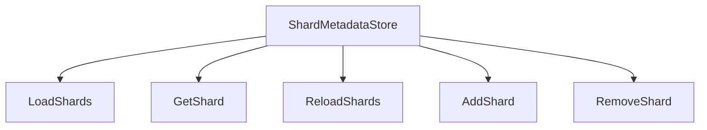
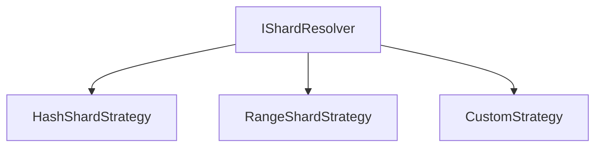
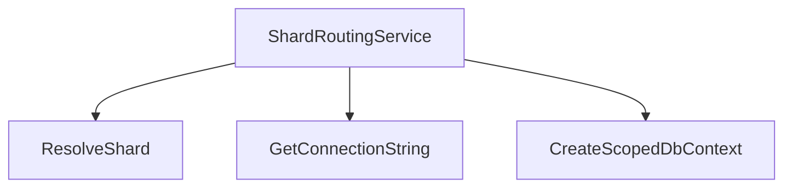
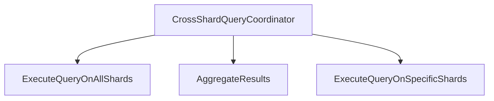
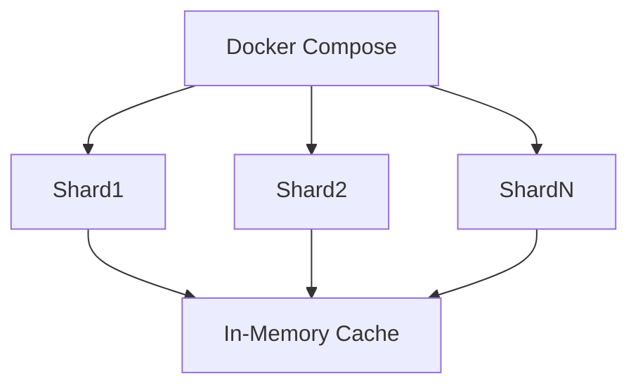
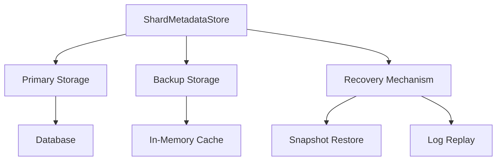
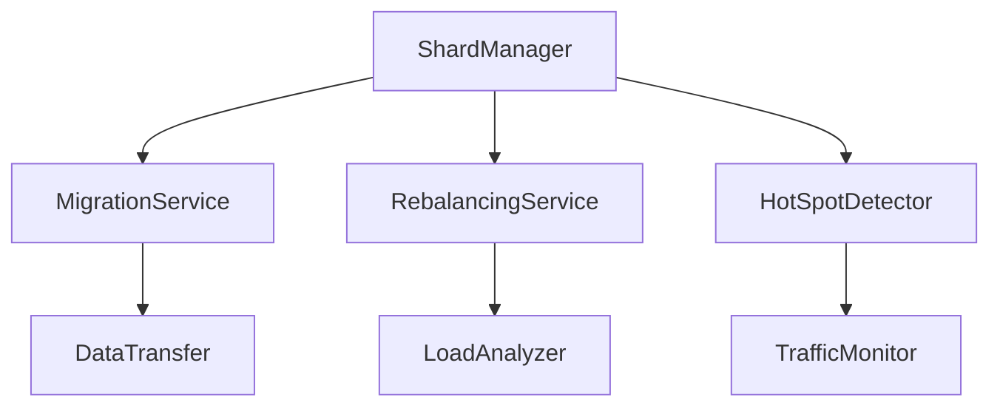
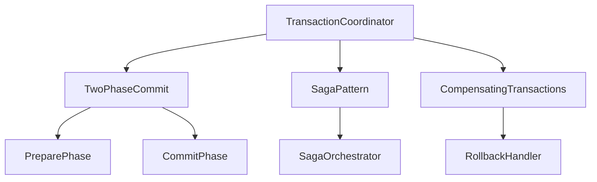

# Sharding Architecture Refactor Plan

## Overview

This document outlines the refactor plan for implementing a comprehensive sharding architecture based on Microsoft's Sharding Pattern. The goal is to enhance the current implementation with additional features and best practices for distributed data access, isolation, and scaling.

## Current State Analysis

The current implementation includes:

1. **Shard Resolution**: Uses consistent hashing with `ConsistentHashRing` to distribute data across shards.
2. **Shard Configuration**: Loads shard configurations from `appsettings.json`.
3. **DbContext Factory**: Creates sharded DbContext instances based on shard keys.
4. **Shard Strategies**: Supports `IntHashShardStrategy` and `GuidHashShardStrategy`.
5. **Shard Metadata Store**: Implemented with in-memory caching (IMemoryCache) for dynamic shard configuration management.
6. **Shard Resolver**: Enhanced with pluggable strategies including range-based resolution (`RangeShardStrategy`).
7. **Shard Routing Service**: Implemented with dynamic routing and scoped DbContext creation for proper lifecycle management.
8. **Cross-Shard Query Support**: Implemented with parallel execution and result aggregation through `CrossShardQueryCoordinator`.
9. **Docker Compose**: Updated with 6 MySQL shards (Shard0-Shard5) and no Redis dependency, reflecting a production-ready architecture.
10. **Shard Migration/Transaction Services**: Implemented interfaces and classes for advanced features including `IShardMigrationService` and `ITransactionCoordinator`.
11. **Code Quality**: Refactored to eliminate shard loading duplication and improve maintainability.

## Proposed Architecture

### 1. Shard Metadata Store

**Purpose**: Manage shard metadata, including loading shard configurations and supporting dynamic reloads.

**Design**:

**Implementation Steps**:

1. Create `IShardMetadataStore` interface with methods for loading, getting, reloading, adding, and removing shards.
2. Implement `ShardMetadataStore` class that loads shard configurations from `appsettings.json` and supports dynamic reloads.
3. Update `Program.cs` to register `IShardMetadataStore` as a singleton service.
4. Modify `ShardConfigurationHelper` to use `IShardMetadataStore` for loading shards.

### 2. Pluggable Shard Resolver

**Purpose**: Support multiple shard resolution strategies (e.g., hash, range).

**Design**:

**Implementation Steps**:

1. Enhance `IShardResolutionStrategy` to support range-based resolution.
2. Implement `RangeShardStrategy` for range-based shard resolution.
3. Update `ShardResolver` to support dynamic strategy registration.
4. Add configuration to `appsettings.json` for specifying the default shard resolution strategy.

### 3. Shard Routing Service

**Purpose**: Dynamically inject connection strings and ensure each DbContext is scoped to a shard.

**Design**:

**Implementation Steps**:

1. Create `IShardRoutingService` interface with methods for resolving shards, getting connection strings, and creating scoped DbContext instances.
2. Implement `ShardRoutingService` class that uses `IShardResolver` and `IShardMetadataStore` to resolve shards and create scoped DbContext instances.
3. Update `ShardedDbContextFactory` to use `IShardRoutingService` for creating DbContext instances.
4. Modify controllers to use `IShardRoutingService` for creating scoped DbContext instances.

### 4. Cross-Shard Query Support

**Purpose**: Handle fan-out queries and aggregate results.

**Design**:

**Implementation Steps**:

1. Create `ICrossShardQueryCoordinator` interface with methods for executing queries on all shards and aggregating results.
2. Implement `CrossShardQueryCoordinator` class that uses `IShardMetadataStore` and `IShardedDbContextFactory` to execute queries on multiple shards and aggregate results.
3. Update `PublicationsController` to use `ICrossShardQueryCoordinator` for cross-shard queries.
4. Add support for parallel query execution to improve performance.

### 5. Updated Docker Compose

**Purpose**: Reflect the new sharded architecture.

**Design**:

**Implementation Steps**:

1. Add a new service for the Shard Metadata Store.
2. Update the MySQL shard configurations to include more shards for better scalability.
3. Add health checks and readiness probes for each shard.
4. Configure networking to ensure proper communication between services.

### 6. Resilient Shard Metadata Persistence Model

**Purpose**: Ensure the shard metadata store can persist and recover from failures while simplifying the architecture.

**Design**:

**Implementation Steps**:

1. **Primary Storage**: Use a relational database (e.g., PostgreSQL) as the primary storage for shard metadata.
2. **Backup Storage**: Implement periodic snapshots and transaction logs stored in distributed storage (e.g., S3, Azure Blob Storage).
3. **Recovery Mechanism**:
   - Implement snapshot-based recovery for quick restoration.
   - Add transaction log replay for point-in-time recovery.
4. **Caching Layer**: Use `IMemoryCache` for caching frequently accessed metadata to improve performance while simplifying the architecture.
5. **Consistency Checks**: Implement periodic consistency checks between primary and backup storage.
6. **Failure Detection**: Add health monitoring and automatic failover mechanisms.

### 7. Shard Migration / Rebalancing / Hot-Spot Relief

**Purpose**: Handle dynamic shard management for load balancing and scalability.

**Design**:

**Implementation Steps**:

1. **Shard Migration Service**:
   - Implement data transfer protocols for moving data between shards.
   - Support online migration with minimal downtime.
   - Add validation and verification steps post-migration.

2. **Rebalancing Service**:
   - Implement load analysis to detect imbalanced shards.
   - Add automatic rebalancing algorithms (e.g., consistent hashing adjustments).
   - Support manual rebalancing triggers via API.

3. **Hot-Spot Detection and Relief**:
   - Implement real-time traffic monitoring.
   - Add dynamic shard splitting for hot shards.
   - Support temporary traffic redirection during hot-spot conditions.

4. **Safety Mechanisms**:
   - Implement rate limiting during migrations.
   - Add rollback capabilities for failed migrations.
   - Support gradual traffic shifting to new shards.

### 8. Cross-Shard Transaction Guarantees & Constraints

**Purpose**: Define transactional guarantees and constraints for cross-shard operations.

**Design**:

**Implementation Steps**:

1. **Transactional Guarantees**:
   - Implement two-phase commit for strong consistency across shards.
   - Add saga pattern support for long-running transactions.
   - Support compensating transactions for rollback scenarios.

2. **Constraints and Limitations**:
   - Document that cross-shard transactions may have higher latency.
   - Define maximum transaction duration limits.
   - Specify data consistency levels (e.g., eventual vs. strong consistency).

3. **Error Handling**:
   - Implement comprehensive error detection and recovery.
   - Add transaction timeout mechanisms.
   - Support manual intervention for stuck transactions.

4. **Monitoring and Logging**:
   - Implement detailed transaction logging.
   - Add real-time monitoring of cross-shard transactions.
   - Support alerting for failed or long-running transactions.

## Implementation Plan

### Phase 1: Shard Metadata Store

1. **Create `IShardMetadataStore` Interface**
   - Define methods for loading, getting, reloading, adding, and removing shards.
   - Ensure thread safety for concurrent access.

2. **Implement `ShardMetadataStore` Class**
   - Load shard configurations from `appsettings.json`.
   - Support dynamic reloads of shard configurations.
   - Implement methods for adding and removing shards at runtime.

3. **Update `Program.cs`**
   - Register `IShardMetadataStore` as a singleton service.
   - Configure the Shard Metadata Store with the application configuration.

4. **Modify `ShardConfigurationHelper`**
   - Update to use `IShardMetadataStore` for loading shards.
   - Ensure backward compatibility with existing code.

### Phase 2: Pluggable Shard Resolver

1. **Enhance `IShardResolutionStrategy`**
   - Add support for range-based resolution.
   - Define methods for validating shard keys and resolving shards.

2. **Implement `RangeShardStrategy`**
   - Support range-based shard resolution for numeric and date-based keys.
   - Ensure compatibility with existing hash-based strategies.

3. **Update `ShardResolver`**
   - Support dynamic strategy registration.
   - Add configuration for specifying the default shard resolution strategy.

4. **Update `appsettings.json`**
   - Add configuration for specifying the default shard resolution strategy.
   - Include configuration for range-based shard resolution.

### Phase 3: Shard Routing Service

1. **Create `IShardRoutingService` Interface**
   - Define methods for resolving shards, getting connection strings, and creating scoped DbContext instances.
   - Ensure support for both synchronous and asynchronous operations.

2. **Implement `ShardRoutingService` Class**
   - Use `IShardResolver` and `IShardMetadataStore` to resolve shards.
   - Create scoped DbContext instances for each shard.
   - Ensure proper disposal of DbContext instances.

3. **Update `ShardedDbContextFactory`**
   - Use `IShardRoutingService` for creating DbContext instances.
   - Ensure backward compatibility with existing code.

4. **Modify Controllers**
   - Update `UsersController` and `PublicationsController` to use `IShardRoutingService`.
   - Ensure proper disposal of DbContext instances.

### Phase 4: Cross-Shard Query Support

1. **Create `ICrossShardQueryCoordinator` Interface**
   - Define methods for executing queries on all shards and aggregating results.
   - Support both synchronous and asynchronous operations.

2. **Implement `CrossShardQueryCoordinator` Class**
   - Use `IShardMetadataStore` and `IShardedDbContextFactory` to execute queries on multiple shards.
   - Aggregate results from multiple shards.
   - Support parallel query execution for improved performance.

3. **Update `PublicationsController`**
   - Use `ICrossShardQueryCoordinator` for cross-shard queries.
   - Ensure proper handling of aggregated results.

4. **Add Support for Parallel Query Execution**
   - Implement parallel query execution to improve performance.
   - Ensure proper synchronization and error handling.

### Phase 5: Updated Docker Compose

1. **Remove Shard Metadata Service (Redis)**
   - The Shard Metadata Service (Redis) has been removed from the architecture.
   - Shard metadata is now managed in-memory using `IMemoryCache` for improved performance and simplified deployment.
   - This eliminates the need for a separate Redis container in the Docker Compose setup.

2. **Update MySQL Shard Configurations**
   - Configure multiple MySQL shards for better scalability.
   - Configure health checks and readiness probes for each shard.
   - Current implementation includes 6 shards (Shard0-Shard5) for distributed data storage.

3. **Configure Networking**
   - Ensure proper communication between the application and MySQL shards.
   - Configure networking to support cross-shard queries without external Redis dependency.

4. **Update `appsettings.json`**
   - Add connection strings for all configured MySQL shards.
   - Configure in-memory caching settings for shard metadata management.

### Phase 6: Resilient Shard Metadata Persistence Model

1. **Implement Primary Storage**
   - Create database schema for shard metadata storage.
   - Implement repository pattern for metadata access.
   - Add transaction support for metadata operations.

2. **Implement Backup and Recovery**
   - Create snapshot service for periodic backups.
   - Implement transaction log capture and storage.
   - Add restore functionality from snapshots and logs.

3. **Add Caching Layer**
   - Implement `IMemoryCache` for frequently accessed metadata to simplify the architecture while maintaining core functionality.
   - Add cache invalidation mechanisms.
   - Implement cache warming on startup.

4. **Add Monitoring and Health Checks**
   - Implement health monitoring for metadata store.
   - Add automatic failover detection.
   - Create alerting for metadata store issues.

### Phase 7: Shard Migration / Rebalancing / Hot-Spot Relief

1. **Implement Migration Service**
   - Create data transfer protocols and APIs.
   - Implement online migration with minimal downtime.
   - Add validation and verification post-migration.

2. **Implement Rebalancing Service**
   - Create load analysis algorithms.
   - Implement automatic rebalancing triggers.
   - Add manual rebalancing API endpoints.

3. **Implement Hot-Spot Detection**
   - Create real-time traffic monitoring.
   - Implement dynamic shard splitting.
   - Add temporary traffic redirection.

4. **Add Safety Mechanisms**
   - Implement rate limiting during migrations.
   - Add rollback capabilities.
   - Support gradual traffic shifting.

### Phase 8: Cross-Shard Transaction Guarantees & Constraints

1. **Implement Transaction Coordinator**
   - Create two-phase commit implementation.
   - Implement saga pattern support.
   - Add compensating transaction handling.

2. **Define Constraints and Limitations**
   - Document transaction latency expectations.
   - Define maximum transaction durations.
   - Specify consistency levels.

3. **Implement Error Handling**
   - Add comprehensive error detection.
   - Implement transaction timeout mechanisms.
   - Support manual intervention APIs.

4. **Add Monitoring and Logging**
   - Implement detailed transaction logging.
   - Add real-time monitoring dashboards.
   - Create alerting for transaction issues.
