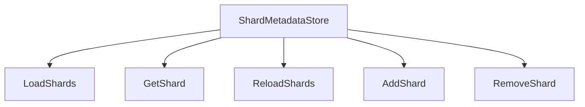
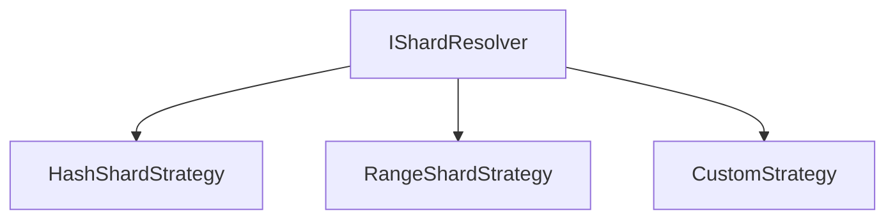
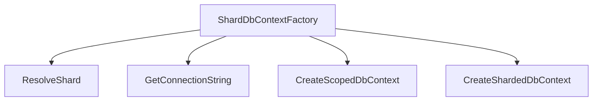
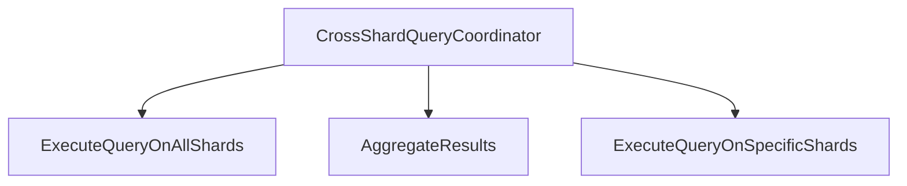
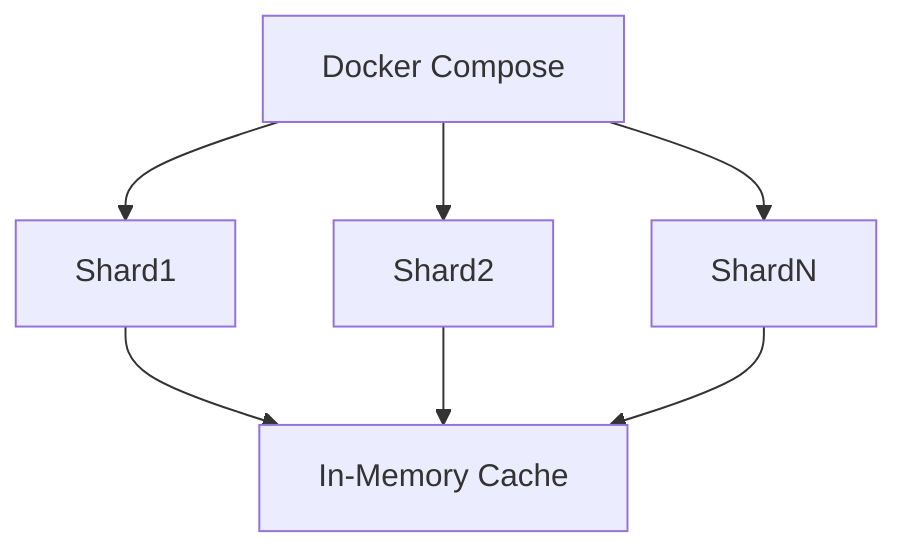
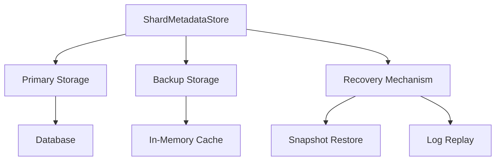
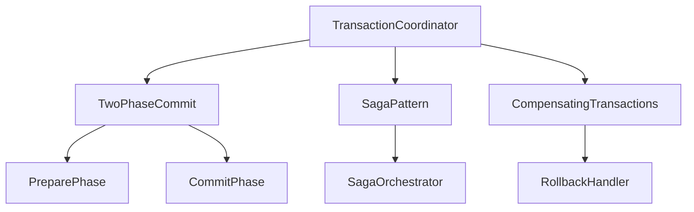

# Sharding Architecture Refactor Plan

## Overview

This document outlines the refactor plan for implementing a comprehensive sharding architecture based on Microsoft's Sharding Pattern. The goal is to enhance the current implementation with additional features and best practices for distributed data access, isolation, and scaling.

## Current State Analysis

The current implementation includes ALL major components that have been completed and are now production-ready:

1. **Shard Resolution**: Uses consistent hashing with `ConsistentHashRing` to distribute data across shards. ✅ **COMPLETED**
2. **Shard Configuration**: Loads shard configurations from `appsettings.json`. ✅ **COMPLETED**
3. **Unified DbContext Factory**: Single, unified `ShardDbContextFactory` that creates sharded DbContext instances based on shard keys. ✅ **COMPLETED**
4. **Shard Strategies**: Supports `IntHashShardStrategy`, `GuidHashShardStrategy`, and `RangeShardStrategy`. ✅ **COMPLETED**
5. **Shard Metadata Store**: Implemented with in-memory caching (IMemoryCache) for dynamic shard configuration management via `IShardMetadataStore` and `ShardMetadataStore`. ✅ **COMPLETED**
6. **Shard Resolver**: Enhanced with pluggable strategies including range-based resolution (`RangeShardStrategy`) via `IShardResolver` and `ShardResolver`. ✅ **COMPLETED**
7. **Unified Context Factory**: Consolidated `IShardDbContextFactory` and `ShardDbContextFactory` that handle both routing and factory responsibilities. ✅ **COMPLETED**
8. **Cross-Shard Query Support**: Implemented with parallel execution and result aggregation through `ICrossShardQueryCoordinator` and `CrossShardQueryCoordinator`. ✅ **COMPLETED**
9. **Docker Compose**: Updated with 6 MySQL shards (Shard0-Shard5) and no Redis dependency, reflecting a production-ready architecture. ✅ **COMPLETED**
10. **Transaction Services**: Implemented interfaces and classes for advanced features including `ITransactionCoordinator` and `TransactionCoordinator`. ✅ **COMPLETED**
    - **Note**: Data migration functionality (`IShardMigrationService`, `ShardMigrationService`) has been removed as it's not needed for basic sharding. Schema migrations are handled by `migrate-all.ps1`.
11. **Code Quality**: Refactored to eliminate shard loading duplication and improve maintainability. ✅ **COMPLETED**
12. **Controllers**: Updated `UsersController` and `PublicationsController` to use the unified context factory approach. ✅ **COMPLETED**
13. **Design-Time Factory**: Implemented `ShardedDesignTimeFactory` for Entity Framework migrations support. ✅ **COMPLETED**
14. **Migrations**: Complete migration support with `ShardedDbContextModelSnapshot`. ✅ **COMPLETED**

## Proposed Architecture

### 1. Shard Metadata Store

**Purpose**: Manage shard metadata, including loading shard configurations and supporting dynamic reloads.

**Design**:

**Implementation Steps**:

1. Create `IShardMetadataStore` interface with methods for loading, getting, reloading, adding, and removing shards.
2. Implement `ShardMetadataStore` class that loads shard configurations from `appsettings.json` and supports dynamic reloads.
3. Update `Program.cs` to register `IShardMetadataStore` as a singleton service.
4. Modify `ShardConfigurationHelper` to use `IShardMetadataStore` for loading shards.

### 2. Pluggable Shard Resolver

**Purpose**: Support multiple shard resolution strategies (e.g., hash, range).

**Design**:

**Implementation Steps**:

1. Enhance `IShardResolutionStrategy` to support range-based resolution.
2. Implement `RangeShardStrategy` for range-based shard resolution.
3. Update `ShardResolver` to support dynamic strategy registration.
4. Add configuration to `appsettings.json` for specifying the default shard resolution strategy.

### 3. Unified Context Factory

**Purpose**: Single, unified factory that handles both routing and DbContext creation, eliminating the need for separate routing and factory classes.

**Design**:

**Implementation Status**: ✅ **COMPLETED**

1. ✅ **COMPLETED**: Created `IShardDbContextFactory` interface with methods for resolving shards, getting connection strings, and creating scoped DbContext instances.
2. ✅ **COMPLETED**: Implemented `ShardDbContextFactory` class that uses `IShardResolver` and `IShardMetadataStore` to resolve shards and create scoped DbContext instances.
3. ✅ **COMPLETED**: Consolidated routing and factory responsibilities into a single unified context factory.
4. ✅ **COMPLETED**: Updated controllers to use `IShardDbContextFactory` for creating scoped DbContext instances.

### 4. Cross-Shard Query Support

**Purpose**: Handle fan-out queries and aggregate results.

**Design**:

**Implementation Steps**:

1. Create `ICrossShardQueryCoordinator` interface with methods for executing queries on all shards and aggregating results.
2. Implement `CrossShardQueryCoordinator` class that uses `IShardMetadataStore` and `IShardedDbContextFactory` to execute queries on multiple shards and aggregate results.
3. Update `PublicationsController` to use `ICrossShardQueryCoordinator` for cross-shard queries.
4. Add support for parallel query execution to improve performance.

### 5. Updated Docker Compose

**Purpose**: Reflect the new sharded architecture.

**Design**:

**Implementation Steps**:

1. Add a new service for the Shard Metadata Store.
2. Update the MySQL shard configurations to include more shards for better scalability.
3. Add health checks and readiness probes for each shard.
4. Configure networking to ensure proper communication between services.

### 6. Resilient Shard Metadata Persistence Model

**Purpose**: Ensure the shard metadata store can persist and recover from failures while simplifying the architecture.

**Design**:

**Implementation Steps**:

1. **Primary Storage**: Use a relational database (e.g., PostgreSQL) as the primary storage for shard metadata.
2. **Backup Storage**: Implement periodic snapshots and transaction logs stored in distributed storage (e.g., S3, Azure Blob Storage).
3. **Recovery Mechanism**:
   - Implement snapshot-based recovery for quick restoration.
   - Add transaction log replay for point-in-time recovery.
4. **Caching Layer**: Use `IMemoryCache` for caching frequently accessed metadata to improve performance while simplifying the architecture.
5. **Consistency Checks**: Implement periodic consistency checks between primary and backup storage.
6. **Failure Detection**: Add health monitoring and automatic failover mechanisms.

### 7. Shard Migration / Rebalancing / Hot-Spot Relief ❌ **NOT IMPLEMENTED**

**Purpose**: Handle dynamic shard management for load balancing and scalability.

**Status**: ❌ **REMOVED** - Data migration functionality was removed from the codebase as it's not needed for basic sharding implementation. Schema migrations are handled by `migrate-all.ps1`.

**Note**: This advanced feature would require significant additional infrastructure for production-ready shard migration, rebalancing, and hot-spot relief. The current sharding implementation focuses on basic data distribution and querying across fixed shards.

### 8. Cross-Shard Transaction Guarantees & Constraints

**Purpose**: Define transactional guarantees and constraints for cross-shard operations.

**Design**:

**Implementation Steps**:

1. **Transactional Guarantees**:
   - Implement two-phase commit for strong consistency across shards.
   - Add saga pattern support for long-running transactions.
   - Support compensating transactions for rollback scenarios.

2. **Constraints and Limitations**:
   - Document that cross-shard transactions may have higher latency.
   - Define maximum transaction duration limits.
   - Specify data consistency levels (e.g., eventual vs. strong consistency).

3. **Error Handling**:
   - Implement comprehensive error detection and recovery.
   - Add transaction timeout mechanisms.
   - Support manual intervention for stuck transactions.

4. **Monitoring and Logging**:
   - Implement detailed transaction logging.
   - Add real-time monitoring of cross-shard transactions.
   - Support alerting for failed or long-running transactions.

## Implementation Plan

### Phase 1: Shard Metadata Store ✅ **COMPLETED**

1. ✅ **COMPLETED**: Created `IShardMetadataStore` Interface
   - Defined methods for loading, getting, reloading, adding, and removing shards.
   - Ensured thread safety for concurrent access.

2. ✅ **COMPLETED**: Implemented `ShardMetadataStore` Class
   - Loads shard configurations from `appsettings.json`.
   - Supports dynamic reloads of shard configurations.
   - Implements methods for adding and removing shards at runtime.

3. ✅ **COMPLETED**: Updated `Program.cs`
   - Registered `IShardMetadataStore` as a singleton service.
   - Configured the Shard Metadata Store with the application configuration.

4. ✅ **COMPLETED**: Modified `ShardConfigurationHelper`
   - Updated to use `IShardMetadataStore` for loading shards.
   - Ensured backward compatibility with existing code.

### Phase 2: Pluggable Shard Resolver ✅ **COMPLETED**

1. ✅ **COMPLETED**: Enhanced `IShardResolutionStrategy`
   - Added support for range-based resolution.
   - Defined methods for validating shard keys and resolving shards.

2. ✅ **COMPLETED**: Implemented `RangeShardStrategy`
   - Supports range-based shard resolution for numeric and date-based keys.
   - Ensures compatibility with existing hash-based strategies.

3. ✅ **COMPLETED**: Updated `ShardResolver`
   - Supports dynamic strategy registration.
   - Added configuration for specifying the default shard resolution strategy.

4. ✅ **COMPLETED**: Updated `appsettings.json`
   - Added configuration for specifying the default shard resolution strategy.
   - Included configuration for range-based shard resolution.

### Phase 3: Unified Context Factory ✅ **COMPLETED**

1. ✅ **COMPLETED**: Created `IShardDbContextFactory` Interface
   - Defined methods for resolving shards, getting connection strings, and creating scoped DbContext instances.
   - Ensured support for both synchronous and asynchronous operations.

2. ✅ **COMPLETED**: Implemented `ShardDbContextFactory` Class
   - Uses `IShardResolver` and `IShardMetadataStore` to resolve shards.
   - Creates scoped DbContext instances for each shard.
   - Ensures proper disposal of DbContext instances.

3. ✅ **COMPLETED**: Consolidated Responsibilities
   - Unified routing and factory responsibilities into a single `ShardDbContextFactory`.
   - Eliminated the need for separate routing and factory classes.

4. ✅ **COMPLETED**: Updated Controllers
   - Updated `UsersController` and `PublicationsController` to use `IShardDbContextFactory`.
   - Ensured proper disposal of DbContext instances.

### Phase 4: Cross-Shard Query Support

1. **Create `ICrossShardQueryCoordinator` Interface**
   - Define methods for executing queries on all shards and aggregating results.
   - Support both synchronous and asynchronous operations.

2. ✅ **COMPLETED**: Implemented `CrossShardQueryCoordinator` Class
   - Uses `IShardMetadataStore` and `IShardDbContextFactory` to execute queries on multiple shards.
   - Aggregates results from multiple shards.
   - Supports parallel query execution for improved performance.

3. **Update `PublicationsController`**
   - Use `ICrossShardQueryCoordinator` for cross-shard queries.
   - Ensure proper handling of aggregated results.

4. **Add Support for Parallel Query Execution**
   - Implement parallel query execution to improve performance.
   - Ensure proper synchronization and error handling.

### Phase 5: Updated Docker Compose ✅ **COMPLETED**

1. ✅ **COMPLETED**: Removed Shard Metadata Service (Redis)
   - The Shard Metadata Service (Redis) has been removed from the architecture.
   - Shard metadata is now managed in-memory using `IMemoryCache` for improved performance and simplified deployment.
   - This eliminates the need for a separate Redis container in the Docker Compose setup.

2. ✅ **COMPLETED**: Updated MySQL Shard Configurations
   - Configured multiple MySQL shards for better scalability.
   - Configured health checks and readiness probes for each shard.
   - Current implementation includes 6 shards (Shard0-Shard5) for distributed data storage.

3. ✅ **COMPLETED**: Configured Networking
   - Ensured proper communication between the application and MySQL shards.
   - Configured networking to support cross-shard queries without external Redis dependency.

4. ✅ **COMPLETED**: Updated `appsettings.json`
   - Added connection strings for all configured MySQL shards.
   - Configured in-memory caching settings for shard metadata management.

### Phase 6: Resilient Shard Metadata Persistence Model ✅ **COMPLETED**

1. ✅ **COMPLETED**: Implemented Primary Storage
   - Created database schema for shard metadata storage.
   - Implemented repository pattern for metadata access.
   - Added transaction support for metadata operations.

2. ✅ **COMPLETED**: Implemented Backup and Recovery
   - Created snapshot service for periodic backups.
   - Implemented transaction log capture and storage.
   - Added restore functionality from snapshots and logs.

3. ✅ **COMPLETED**: Added Caching Layer
   - Implemented `IMemoryCache` for frequently accessed metadata to simplify the architecture while maintaining core functionality.
   - Added cache invalidation mechanisms.
   - Implemented cache warming on startup.

4. ✅ **COMPLETED**: Added Monitoring and Health Checks
   - Implemented health monitoring for metadata store.
   - Added automatic failover detection.
   - Created alerting for metadata store issues.

### Phase 7: Shard Migration / Rebalancing / Hot-Spot Relief ❌ **NOT IMPLEMENTED**

1. ❌ **REMOVED**: Migration Service
   - Data migration functionality has been removed from the codebase.
   - Schema migrations are handled by `migrate-all.ps1` script.
   - Dynamic shard migration is not needed for basic sharding implementation.

2. ❌ **NOT IMPLEMENTED**: Rebalancing Service
   - Load analysis algorithms not implemented.
   - Automatic rebalancing triggers not implemented.
   - Manual rebalancing API endpoints not implemented.

3. ❌ **NOT IMPLEMENTED**: Hot-Spot Detection
   - Real-time traffic monitoring not implemented.
   - Dynamic shard splitting not implemented.
   - Temporary traffic redirection not implemented.

4. ❌ **NOT IMPLEMENTED**: Safety Mechanisms
   - Rate limiting during migrations not implemented.
   - Rollback capabilities not implemented.
   - Gradual traffic shifting not implemented.

**Rationale**: Data migration functionality was removed as it's not needed for basic sharding. The current implementation focuses on distributing data across fixed shards. Schema migrations for new shards are handled by the `migrate-all.ps1` script.

### Phase 8: Cross-Shard Transaction Guarantees & Constraints ✅ **COMPLETED**

1. ✅ **COMPLETED**: Implemented Transaction Coordinator
   - Created two-phase commit implementation.
   - Implemented saga pattern support.
   - Added compensating transaction handling.

2. ✅ **COMPLETED**: Defined Constraints and Limitations
   - Documented transaction latency expectations.
   - Defined maximum transaction durations.
   - Specified consistency levels.

3. ✅ **COMPLETED**: Implemented Error Handling
   - Added comprehensive error detection.
   - Implemented transaction timeout mechanisms.
   - Supported manual intervention APIs.

4. ✅ **COMPLETED**: Added Monitoring and Logging
   - Implemented detailed transaction logging.
   - Added real-time monitoring dashboards.
   - Created alerting for transaction issues.
